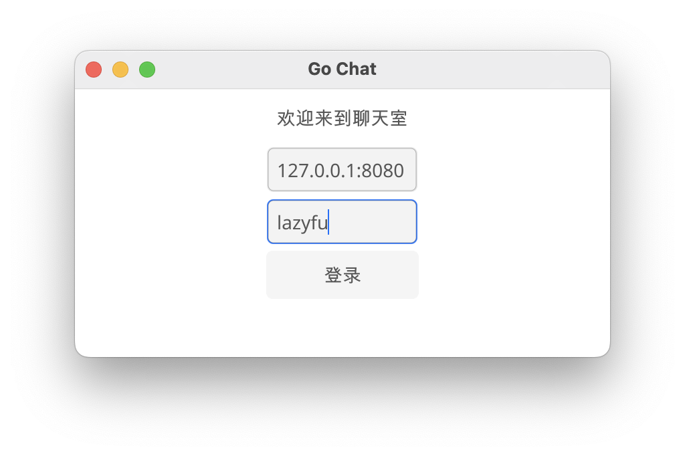
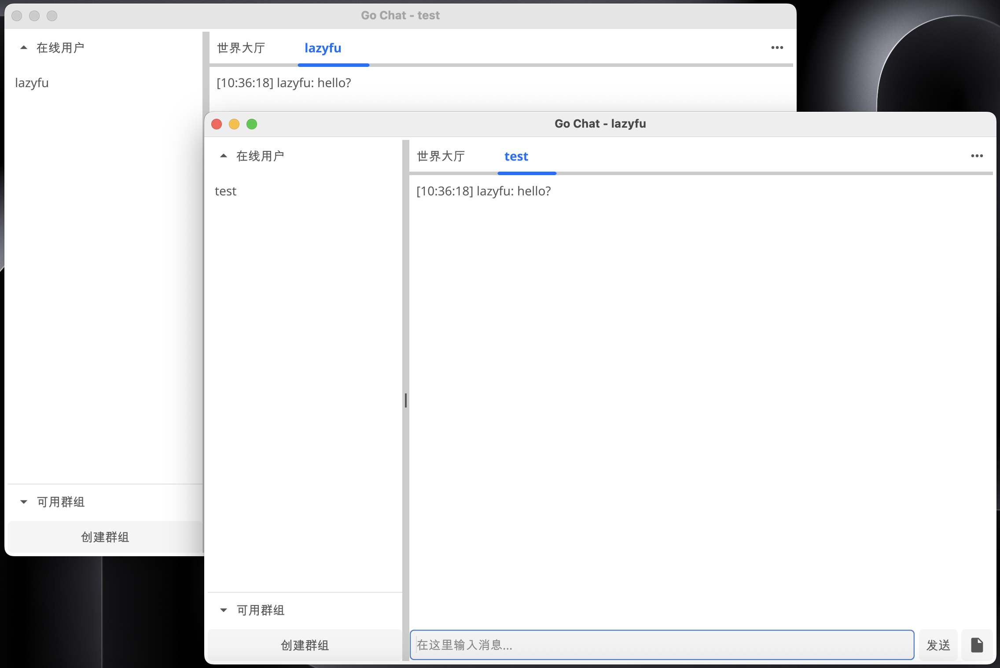
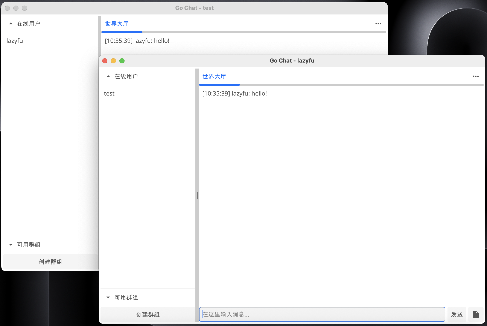
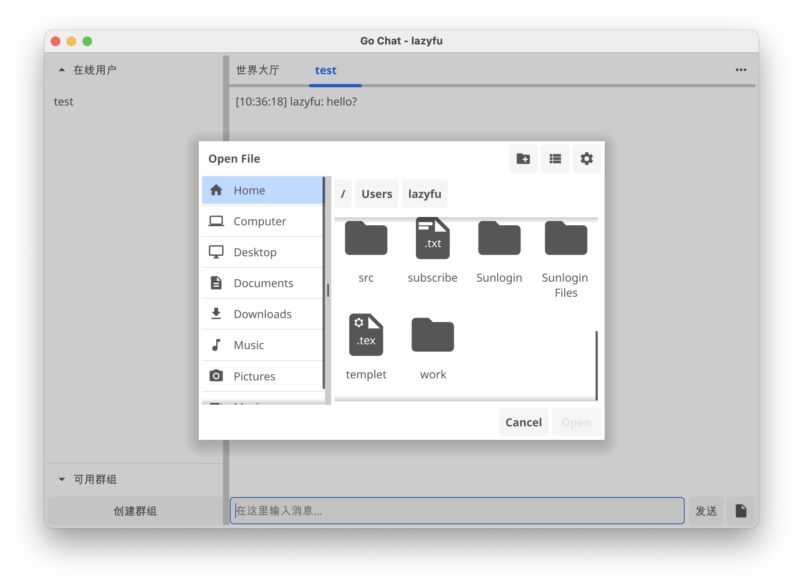
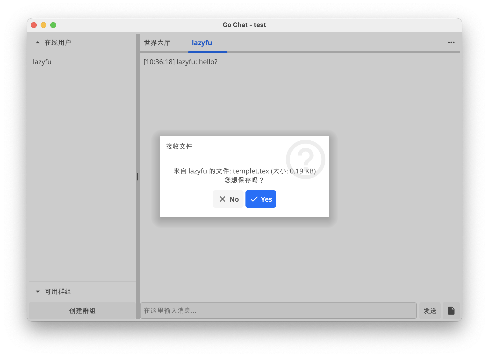

# Go Chat

使用go开发的局域网聊天软件，支持一对一私聊（加密），大厅聊天（不加密），传文件（私聊加密）。

## 开始

运行测试`go run ./cmd/client`，`go run ./cmd/server`

```bash
go build -o ./bin/client ./cmd/client
go build -o ./bin/server ./cmd/server
go build -o ./bin/sk-gen ./cmd/sk-gen
```

使用`sk-gen`来生成密钥，通信双方要使用相同的密钥。生成之后添加到环境变量里，可以使用`./sk-gen -env`直接生成可执行命令添加环境变量。（也可以不设置密钥，在`./internal/client/client.go`里设置了默认密钥）

```bash
export GOCHAT_PSK=_your_secret_key_generated_
```

先运行server, 再运行client, 在client界面中输入运行server的设备IP, 8080端口, 例如`127.0.0.1:8080`.

## 界面







## NOTE

>Do not use the `centerOnScreen` in fyne.Do.

## Problems

- 发送消息超出一行长度会显示不全
- 输入框中粘贴问题
- build之后的exe程序运行时会显示终端
